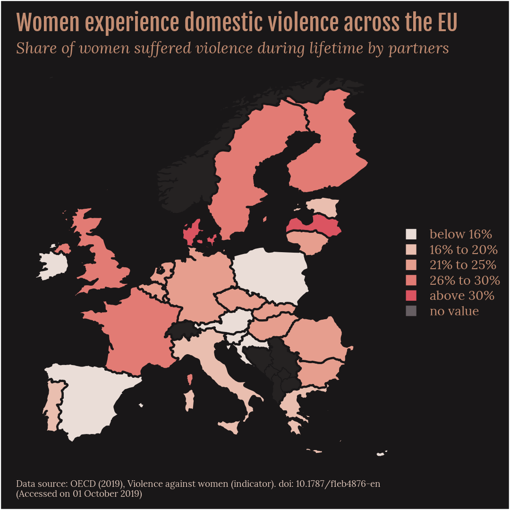
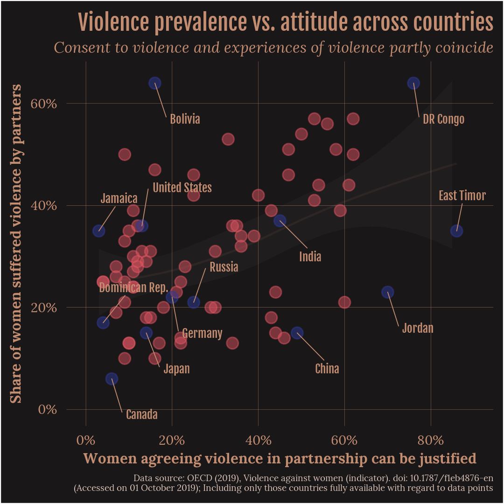

```{r setup, include = F}
knitr::opts_chunk$set(echo = TRUE)
```


### Packages und supporting function
In this script the following libraries/packages are used.
```{r libraries, message = F, warning = F}
library(dplyr)                            # data manipulation focused on data frames
library(ggplot2)                          # general plotting engine
library(ggrepel)                          # labels with allocation line
library(showtext)                         # usage of Google fonts
```

Furthermore, the function getCountriesOf() is defined. This makes it easier to subdivide states by membership to some specific organizations, here EU and OECD.
```{r country_groups_function, include = FALSE}
getCountriesOf <- function(organization) {
  if(base::tolower(organization) == 'eu'){                        # European Union
    org_df <- c('AT', 'BE', 'BG', 'CY', 'CZ',
                'DE', 'DK', 'EE', 'ES', 'FI',
                'FR', 'GB', 'GR', 'HR', 'HU',
                'IE', 'IT', 'LT', 'LU', 'LV',
                'MT', 'NL', 'PL', 'PT', 'RO',
                'SE', 'SI', 'SK')
  } else if (base::tolower(organization) == 'eu_neighborhood') {  # EU neighbors
    org_df <- c('AD', 'AL', 'AT', 'BA', 'BE',
                'BG', 'CH', 'CY', 'CZ', 'DE',
                'DK', 'EE', 'ES', 'FI', 'FR',
                'GB', 'GR', 'HR', 'HU', 'IE',
                'IT', 'LI', 'LT', 'LU', 'LV',
                'ME', 'MK', 'MT', 'NL', 'NO',
                'PL', 'PT', 'RO', 'RS', 'SE',
                'SI', 'SK', 'XK')
  } else if (base::tolower(organization) == 'oecd') {             # OECD members
    org_df <- c('AT', 'AU', 'BE', 'CA', 'CH',
                'CL', 'CZ', 'DE', 'DK', 'EE',
                'ES', 'FI', 'FR', 'GB', 'GR',
                'HU', 'IE', 'IL', 'IS', 'IT',
                'JP', 'KR', 'LT', 'LU', 'LV',
                'MX', 'NL', 'NO', 'NZ', 'PL',
                'PT', 'SE', 'SI', 'SK', 'TR',
                'US')
  }
  return(org_df)
}
```


### Style configuration
Selected fonts should be used for the graphics. The selected Fjalla One and Lora will first be added and then made available. Here the package showtext is used.
```{r style01, message = F, warning = F}
font_add_google(name = 'Fjalla One', family = 'Fjalla One')
font_add_google(name = 'Lora', family = 'Lora')
showtext_auto() # have to be called only once
fontTitle = 'Fjalla One'
fontText  = 'Lora'
fontSize  = 20
```

The graphic design also includes a choice of colors, which should be oriented to the topic. Therefore, matching colors are extracted from the image, which is to become the cover picture. Color scales are also created, which allow highlighting or a gradual scale in the visualizations. These colors are then stored in variables so that they can be adjusted centrally if desired.
```{r style02, message = F, warning = F}
cBackground = '#191718'
cShadow     = '#59504b'
cTitle      = '#c38d72'
cText       = '#d9c2b6'
cScatter    = c('#db5461', '#2e3b94') # first normal scatter, second highlight scatter
cHue        = c('#eaddd7', '#e9beaf', '#e69e8e', '#e27b74', '#db5461', '#665E62')
cGradual    = c('#f8f3f1', '#920000')
```

Finally, the default values of the ggplot2 theme are adjusted comprehensively. The previously defined fonts and colors are used. For the fonts, factors are set so that the size relation between titles, text and labels fits, even if the font size is generally changed. The margins are enlarged or reduced so that the space for the plot is used as efficiently as possible.

By storing these settings, the same theme can be called up for several plots with one line of code, thus enabling an overall consistent design. Nevertheless, individual elements can still be overwritten later and adapted to the special diagram. This may be necessary for different plots such as scatter and bar plot.
```{r theme, message = F, warning = F}
themeViolence <- theme(
  plot.background  = element_rect(fill       = cBackground),
  panel.background = element_rect(fill       = cBackground),
  plot.title       = element_text(size       = 1.75 * fontSize,
                                  face       = 'plain',
                                  family     = fontTitle,
                                  color      = cTitle,
                                  hjust      = 0.0,
                                  margin     = unit(c(1.0, 0.0, 2.0, 0.0), 'pt')),
  plot.subtitle    = element_text(size       = 1.25 * fontSize,
                                  face       = 'italic',
                                  family     = fontText,
                                  color      = cTitle,
                                  hjust      = 0.0,
                                  margin     = unit(c(0.0, 0.0, -1.5, 0.0), 'pt')),
  plot.caption     = element_text(size       = 0.70 * fontSize,
                                  face       = 'plain',
                                  family     = fontText,
                                  color      = cText,
                                  hjust      = 0.0,
                                  lineheight = 0.3,
                                  margin     = unit(c(-0.75, 0.0, -0.75, 0.0), 'pt')),
  axis.title       = element_text(size       = 1.15 * fontSize,
                                  face       = 'bold',
                                  family     = fontText,
                                  color      = cText,
                                  hjust      = 0.5),
  axis.text        = element_text(size       = 1.05 * fontSize,
                                  face       = 'plain',
                                  family     = fontText,
                                  color      = cText,
                                  hjust      = 0.5),
  
  panel.border       = element_blank(),
  panel.grid.major.x = element_blank(),
  panel.grid.major.y = element_blank(),
  panel.grid.minor.x = element_blank(),
  panel.grid.minor.y = element_blank(),
  axis.ticks.x       = element_blank(),
  axis.ticks.y       = element_blank(),
  axis.line.x.top    = element_blank(),
  axis.line.x.bottom = element_blank(),
  axis.line.y.left   = element_blank(),
  axis.line.y.right  = element_blank(),
  
  legend.position   = 'right',
  legend.background = element_blank(),
  legend.title      = element_blank(),
  legend.text       = element_text(size   = 1.00 * fontSize,
                                   face   = 'plain',
                                   family = fontText,
                                   color  = cTitle,
                                   hjust  = 0.0),
  legend.key        = element_blank(),
  legend.key.size   = unit(2.75, "mm"),
  legend.margin     = margin(0.0, 0.0, 0.0, -15.0),
  
  complete = FALSE
)
```
The font size and margin settings made up to this point are optimized for the corresponding target format. The above example is calibrated to a square post for Instagram, which is 1080 x 1080 pixels according to Chacon [[1](#chacon2019)]. This is also in accordance to the later used ggsave statement with the default plot resolution of 300dpi.

### ISO codes
A shortened spelling is often useful, and various joins and filters can be implemented more easily and quickly using short identification tags. For this reason, the table with the countries ISO codes is added here and slightly modified.

On the one hand Kosovo is amended because the ISO code is not available in the table of the package. In addition, there are different spellings/names of countries between the OECD data set, the ISO code table and the world map from ggplot2. These are aligned for the Czech Republic, Macedonia and the United Kingdom. Finally, only the codes, name, longitude, latitude and grouping are obtained. The latter is necessary to draw the country borders correctly.
```{r iso}
iso <- ISOcodes::ISO_3166_1 %>%
  dplyr::add_row(Alpha_2 = 'XK',
                 Alpha_3 = 'XKX',
                 Name = 'Kosovo') %>%
  dplyr::mutate(Name = case_when(
    Name == 'Czechia'                ~ 'Czech Republic',
    Name == 'Macedonia, Republic of' ~ 'Macedonia',
    TRUE                             ~ Name
  )) %>%
  dplyr::left_join(dplyr::mutate(ggplot2::map_data('world'),
                                 region = case_when(
                                   region == 'UK'   ~ 'United Kingdom',
                                   TRUE             ~ region
                                 )),
                   by = c('Name' = 'region')) %>%
  dplyr::select(Alpha_2, Alpha_3, Name, long, lat, group) %>%
  dplyr::rename(code2 = Alpha_2,
                code3 = Alpha_3,
                country = Name,
                mapgroup = group)
```

### Data wrangling
Now the data is read from the source file. Since different indicators are present in the data set, they are separated from each other. In addition, there are some redundancies resulting from groupings of nations in the data set. For example, France and other countries are assigned to the region "All regions" and "Europe and Central Asia" also. For this reason, only individual values are used via dplyr::filter().
```{r attitudeprevalence}
attitudeviolence <- utils::read.csv('dat/violence.csv', sep = ',', stringsAsFactors = FALSE) %>%
  dplyr::filter(REG == 'ALL' & INC == 'AIC' & VAR == 'RP_1_1') %>%
  dplyr::select(LOCATION, Time, Value) %>%
  dplyr::rename(code3 = LOCATION,
                year = Time,
                attitudeviolence = Value) %>%
  dplyr::arrange(year, code3) %>%
  dplyr::select(code3, year, attitudeviolence) %>%
  stats::reshape(timevar = 'year', idvar = 'code3', direction = 'wide') %>%
  dplyr::rename(attitudeviolence = attitudeviolence.2014)

prevalenceviolence <- utils::read.csv('dat/violence.csv', sep = ',', stringsAsFactors = FALSE) %>%
  dplyr::filter(REG == 'ALL' & INC == 'AIC' & VAR == 'RP_1_2') %>%
  dplyr::select(LOCATION, Time, Value) %>%
  dplyr::rename(code3 = LOCATION,
                year = Time,
                prevalenceviolence = Value) %>%
  dplyr::arrange(year, code3) %>%
  dplyr::select(code3, year, prevalenceviolence) %>%
  stats::reshape(timevar = 'year', idvar = 'code3', direction = 'wide') %>%
  dplyr::rename(prevalenceviolence = prevalenceviolence.2014)
```

Finally, a data frame with attitude towards violence and prevalence of violence as feature columns is created.
```{r pooling}
df <- iso %>%
  dplyr::select(code3) %>%
  base::unique() %>%
  dplyr::left_join(attitudeviolence, by = 'code3') %>%
  dplyr::left_join(prevalenceviolence, by = 'code3')
```

### Creation of data frame and chart for violence in the EU
We now start with the visualization of the data for the European Union and use a choropleth map. First a special data frame is created, which divides the values into categories, so that a discrete colouring is possible. The data frame also contains the longitude and latitude to draw the map with polygons.
```{r eu_dataframe}
df_euviolence <- iso %>%
  dplyr::filter(code2 %in% getCountriesOf('eu')) %>%
  dplyr::left_join(df, by = 'code3') %>%
  dplyr::select(code2, code3, country, long, lat, mapgroup,
                prevalenceviolence) %>%
  dplyr::mutate(category = case_when(              # Introduce categories for clearer viz
    prevalenceviolence <= 0.15 ~ 'below 16%',
    prevalenceviolence <= 0.20 ~ '16% to 20%',
    prevalenceviolence <= 0.25 ~ '21% to 25%',
    prevalenceviolence <= 0.30 ~ '26% to 30%',
    prevalenceviolence > 0.30  ~ 'above 30%',
    TRUE                       ~ 'no value'
  ))

# Factorize violence categories
df_euviolence$category <- factor(df_euviolence$category,
                                 levels = c('below 16%',
                                            '16% to 20%',
                                            '21% to 25%',
                                            '26% to 30%',
                                            'above 30%',
                                            'no value'))
```
Because not all European states are also EU members, a map with gaps would look somewhat strange if only EU states were taken into account. This is why neighbouring states are drawn as polygons that stand out slightly from the background. This results in the familiar shape of the European continent.
```{r eu_neighbouring}
df_euviolence_support <- iso %>%
  dplyr::filter(code2 %in% getCountriesOf('eu_neighborhood')) %>%
  dplyr::filter(lat < 72)
```
Finally, the map can be drawn. Here the previously defined color values and the theme are used. Since the standard labelling of the axes is rather undesirable in the case of such a map, the theme is finally adapted at this point.
```{r eu_plot}
plotViolenceEU <- ggplot() +
  geom_polygon(data  = df_euviolence_support,    # plot European countries
               color = cBackground,
               fill  = cShadow,
               alpha = 0.2,
               size  = 0.2,
               aes(x     = long,
                   y     = lat,
                   group = mapgroup)) +
  geom_polygon(data  = df_euviolence,            # plot EU-members
               color = cBackground,
               size  = 0.5,
               aes(x     = long,
                   y     = lat,
                   group = mapgroup,
                   fill  = category)) +
  scale_fill_manual(values = cHue) +
  labs(title    = 'Women experience domestic violence across the EU',
       subtitle = 'Share of women suffered violence during lifetime by partners',
       x        = NULL,
       y        = NULL,
       caption  = 'Data source: OECD (2019), Violence against women (indicator). doi: 10.1787/f1eb4876-en\n(Accessed on 01 October 2019)',
       tag      = NULL) +
  themeViolence +
  theme( # Alternate specific elements in the standard theme
    axis.text.x = element_blank(),
    axis.text.y = element_blank()
  )
```
```{r, echo=FALSE, out.width='55%', fig.align='center', fig.cap='Direct ouput in R environment'}
plot(plotViolenceEU)
```
As you can see, the graphic is distorted in this way and the font sizes are inappropriate. However, as mentioned above, the graphics will be optimized for the social media channel Instagram. At 300dpi (default for ggsave) this results in dimensions of 9.15 x 9.15cm. The output is then achieved with the following statement.
```{r eu_export}
ggsave(
  filename = 'out/violence_eu.png',
  plot     = plotViolenceEU,
  type     = 'cairo',
  width    = 91.5,
  height   = 91.5,
  units    = 'mm'
)
```
```{r, echo=FALSE, out.width='55%', fig.align='center', fig.cap='Exported EU related chart, optimized for social media'}

```


### Creation of data frame and chart for violence in OECD countries
The configuration of a data frame to be plotted is the same as for the EU countries shown above. Since no map is to be drawn here, the information on longitude and latitude is not required.
```{r oecd_dataframe, include = FALSE}
df_oecdviolence <- iso %>%
  dplyr::filter(code2 %in% getCountriesOf('oecd')) %>%
  dplyr::left_join(df, by = 'code3') %>%
  dplyr::select(code2, code3, country,
                prevalenceviolence) %>%
  base::unique() %>%
  dplyr::mutate(category = case_when(              # Introduce categories for clearer viz
    prevalenceviolence <= 0.05 ~ 'below 5%',
    prevalenceviolence <= 0.10 ~ '6% to 10%',
    prevalenceviolence <= 0.15 ~ '11% to 15%',
    prevalenceviolence <= 0.20 ~ '16% to 20%',
    prevalenceviolence <= 0.25 ~ '21% to 25%',
    prevalenceviolence <= 0.30 ~ '26% to 30%',
    prevalenceviolence <= 0.35 ~ '31% to 35%',
    prevalenceviolence <= 0.40 ~ '36% to 40%',
    prevalenceviolence > 0.40  ~ 'above 40%',
    TRUE                       ~ 'no value'
  )) %>%
  dplyr::filter(!is.na(prevalenceviolence))

# Reorder countries prevalence value 
df_oecdviolence$code3 <- factor(df_oecdviolence$code3,
                                levels = df_oecdviolence$code3[base::order(-df_oecdviolence$prevalenceviolence)])
```
For the plot a few more elements have to be used and changed. All in all, the graphic consists of points with added values, lines as bar alternatives, and text fields for country names. In this case, the color coding is continuous and the labeling of the vertical axis is manually overwritten to percentages. Finally, a few colors are changed and the grid for the y-axis is added.
```{r oecd_plot}
plotViolenceOECD <- ggplot() +
  geom_segment(data  = df_oecdviolence,
               size  = fontSize * 0.0125,
               alpha = 0.65,
               aes(x     = code3,
                   xend  = code3,
                   y     = 0.0,
                   yend  = prevalenceviolence,
                   color = prevalenceviolence)) +
  geom_point(data = df_oecdviolence,
             size  = fontSize * 0.15,
             aes(x     = code3,
                 y     = prevalenceviolence,
                 fill  = prevalenceviolence,
                 color = prevalenceviolence)) +
  geom_text(data  = df_oecdviolence,
            color = cBackground,
            size  = fontSize * 0.333,
            aes(x      = code3,
                y      = prevalenceviolence,
                label  = sprintf("%1.0f", 100*prevalenceviolence),
                hjust  = 0.5,
                family = fontTitle)) +
  geom_text(data  = df_oecdviolence,
            color = cText,
            size  = fontSize * 0.333,
            aes(x      = code3,
                y      = 0,
                label  = country,
                angle  = 90,
                hjust  = 0.0,
                family = fontTitle)) +
  scale_color_gradient(low = cGradual[1], high = cGradual[2]) +
  scale_fill_gradient(low = cGradual[1], high = cGradual[2]) +
  scale_y_continuous(breaks   = c(0.0, 0.1, 0.2, 0.3, 0.4),
                     labels   = c('0%', '10%', '20%', '30%', '40%'),
                     position = 'right') +
  labs(title    = 'Domestic violence is common in OECD countries',
       subtitle = 'Share of women suffered violence during lifetime by partners',
       x        = NULL,
       y        = NULL,
       caption  = 'Data source: OECD (2019), Violence against women (indicator). doi: 10.1787/f1eb4876-en\n(Accessed on 01 October 2019); No value for Republic of Korea and Israel',
       tag      = NULL) +
  themeViolence +
  theme( # Alternate specific elements in the standard theme
    axis.title         = element_text(color    = cTitle),
    axis.text          = element_text(color    = cTitle),
    axis.text.x        = element_blank(),
    panel.grid.major.y = element_line(color    = cTitle,
                                      size     = 0.1,
                                      linetype = 'dotted'),
    legend.position    = 'none'
  )
```
```{r oecd_export, include = FALSE}
ggsave(
  filename = 'out/violence_oecd.png',
  plot     = plotViolenceOECD,
  type     = 'cairo',
  width    = 91.5,
  height   = 91.5,
  units    = 'mm'
)
```
```{r, echo=FALSE, out.width='55%', fig.align='center', fig.cap='Exported OECD related chart, optimized for social media'}

```


### Relationship between attitude towards and prevalence of violence
The last graph to be considered is the relationship between the prevalence of violence and the attitude towards its use. In this two-dimensional illustration, some countries will be highlighted and labelled. The selection for highlighted countries is purely subjective. Here, some major industrial nations and outliers are choosen.
```{r relation_dataframe}
df_relation <- iso %>%
  dplyr::left_join(df, by = 'code3') %>%
  dplyr::select(code2, code3, country,
                attitudeviolence,
                prevalenceviolence) %>%
  base::unique() %>%
  dplyr::mutate(highlight = case_when( # Highlight specific countries
    code2 %in% c('TL', 'ET', 'CD', 'JO', 'JM', 'CA', 'DE',
                 'CN', 'IN', 'US', 'DO', 'BO', 'JP', 'RU') ~ TRUE,
    TRUE                                                   ~ FALSE
  )) %>%
  dplyr::mutate(country = case_when(   # Abbreviate long country names
    code2 == 'TL' ~ 'East Timor',
    code2 == 'CD' ~ 'DR Congo',
    code2 == 'BO' ~ 'Bolivia',
    code2 == 'DO' ~ 'Dominican Rep.',
    code2 == 'RU' ~ 'Russia',
    TRUE          ~ country
  ))
```
An estimation function is added to the scatter plot in the background. The further adjustments are directed to the special design of this graphic, such as the different positioning of the country labels in two groups. For this purpose two geom_text_repel objects are used, whereby one is moved to the positive range and the other to the negative range with nudge_y.
```{r relation_plot}
plotRelationPrevAtt <- ggplot() +
  geom_line(data   = df_relation,
            stat   = 'smooth',
            method = 'loess',
            span   = 1.5,
            alpha  = 0.08,
            color  = cTitle,
            aes(x = attitudeviolence,
                y = prevalenceviolence)) +
  geom_ribbon(data   = df_relation,
              stat   = 'smooth',
              method = 'loess',
              span   = 1.5,
              alpha  = 0.04,
              fill   = cText,
              aes(x = attitudeviolence,
                  y = prevalenceviolence)) +
  geom_point(data  = df_relation,
             alpha = 0.5,
             size  = 0.125 * fontSize,
             aes(x     = attitudeviolence,
                 y     = prevalenceviolence,
                 color = highlight)) +
  geom_text_repel(data          = dplyr::filter(df_relation, code2 %in% c('TL', 'JM', 'US',
                                                                          'DO', 'RU')),
                  family        = fontTitle,
                  color         = cTitle,
                  size          = fontSize * 0.333,
                  hjust         = 0.5,
                  nudge_x       = 0.07,
                  nudge_y       = 0.07,
                  segment.size  = 0.2,
                  segment.color = cTitle,
                  aes(x = attitudeviolence,
                      y = prevalenceviolence,
                      label = country)) +
  geom_text_repel(data          = dplyr::filter(df_relation, code2 %in% c('BO', 'ET', 'CD',
                                                                          'JO', 'DE', 'CN',
                                                                          'IN', 'CA', 'JP')),
                  family        = fontTitle,
                  color         = cTitle,
                  size          = fontSize * 0.333,
                  hjust         = 0.5,
                  nudge_x       = 0.07,
                  nudge_y       = -0.07,
                  segment.size  = 0.2,
                  segment.color = cTitle,
                  aes(x = attitudeviolence,
                      y = prevalenceviolence,
                      label = country)) +
  scale_color_manual(values = c(cScatter[1], cScatter[2])) +
  scale_size(range = c(0, 5)) +
  scale_x_continuous(limits = c(0.00, 0.90),
                     breaks = c(0.0, 0.2, 0.4, 0.6, 0.8),
                     labels = c('0%', '20%', '40%', '60%', '80%')) +
  scale_y_continuous(limits = c(0.00, 0.65),
                     breaks = c(0.0, 0.2, 0.4, 0.6, 0.8),
                     labels = c('0%', '20%', '40%', '60%', '80%')) +
  labs(title    = 'Violence prevalence vs. attitude across countries',
       subtitle = 'Consent to violence and experiences of violence partly coincide',
       x        = 'Women agreeing violence in partnership can be justified',
       y        = 'Share of women suffered violence by partners',
       caption  = 'Data source: OECD (2019), Violence against women (indicator). doi: 10.1787/f1eb4876-en\n(Accessed on 01 October 2019); Including only those countries fully available with regard to data points',
       tag      = NULL) +
  themeViolence +
  theme( # Alternate specific elements in the standard theme
    plot.title         = element_text(hjust = 1.0),
    plot.subtitle      = element_text(hjust  = 1.0,
                                      margin = unit(c(0.0, 0.0, 1.0, 0.0), "pt")),
    plot.caption       = element_text(hjust  = 1.0,
                                      margin = unit(c(+4.0, 0.0, -0.75, 0.0), "pt")),
    axis.title         = element_text(color  = cTitle),
    axis.text          = element_text(color = cTitle),
    panel.grid.major.x = element_line(color    = cTitle,
                                      size     = 0.05,
                                      linetype = 'solid'),
    panel.grid.major.y = element_line(color    = cTitle,
                                      size     = 0.05,
                                      linetype = 'solid'),
    legend.position    = 'none'
  )
```
```{r relation_export, include = FALSE}
ggsave(
  filename = 'out/relation_prevatt.png',
  plot     = plotRelationPrevAtt,
  type     = 'cairo',
  width    = 91.5,
  height   = 91.5,
  units    = 'mm'
)
```
```{r, echo=FALSE, out.width='55%', fig.align='center', fig.cap='Exported relationship chart, optimized for social media'}

```

### References
[[1]]{#chacon2019} B Chacon (2019), Instagram Image Size & Dimensions for 2019 (+ Free Infographic!). https://later.com/blog/instagram-image-size/. Accessed: 2019-11-08
